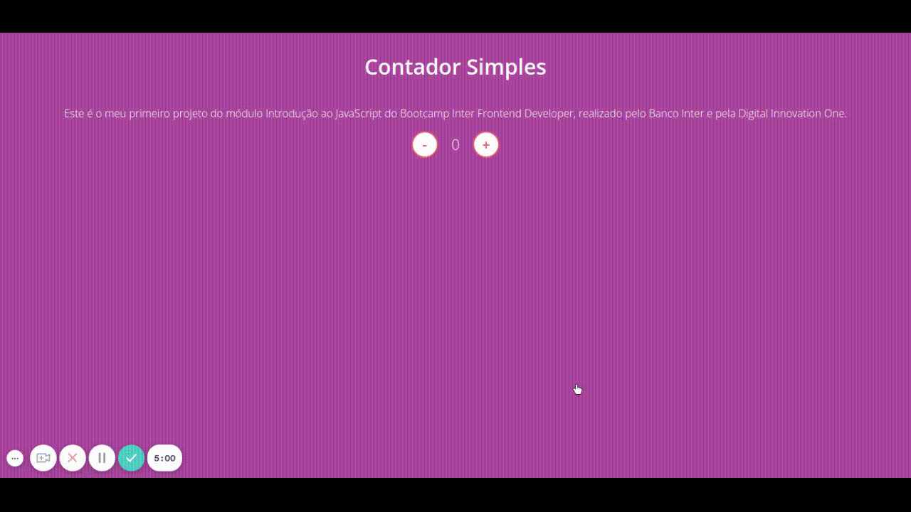

<h1 align="center">
     👩 <a href="#" alt="blog"> Simple Counter </a>
</h1>

<h3 align="center">
    Um contador simples feito para a atividade do módulo de introdução ao JavaScript do Bootcamp Inter Frontend Developer, realizado pelo Banco Inter e pela Digital Innovation One.
</h3>


<p align="center">
  
  
  <a href="https://github.com/carlatakagi/simple-blog/commits/master">
    
  </a>
    
   
   <a href="https://github.com/carlatakagi/simple-blog/stargazers">
    

  </a>
 
</p>

<h4 align="center">
	🚀 Concluído 🚀
</h4>

Tabela de conteúdos
=================
<!--ts-->
   * [Sobre o projeto](#-sobre-o-projeto)
   * [Funcionalidades](#-funcionalidades)
   * [Layout](#-layout)
   * [Como executar o projeto](#-como-executar-o-projeto)
     * [Pré-requisitos](#pré-requisitos)
     * [Rodando a aplicação web (Frontend)](#user-content--rodando-a-aplicação-web-frontend)
   * [Tecnologias](#-tecnologias)
   * [Autora](#-autora)
   * [Licença](#user-content--licença)
<!--te-->


## 💻 Sobre o projeto

   Este é o meu primeiro projeto do módulo Introdução ao JavaScript do Bootcamp Inter Frontend Developer, realizado pelo [Banco Inter](https://www.bancointer.com.br/) e pela [Digital Innovation One](https://digitalinnovation.one/g/)

---

## ⚙️ Funcionalidades

- [x] Um simples contador, que inicia com 0 e ao clicar nos botões (+ e -) pode aumentar ou diminuir o valor inicial.

---

## 🎨 Layout

Conheça a aplicação:

<a href="">
  
</a>

---

## 🚀 Como executar o projeto

### Pré-requisitos

Antes de começar, você vai precisar ter instalado em sua máquina as seguintes ferramentas:
[Git](https://git-scm.com) e a extensão [Live Server](https://marketplace.visualstudio.com/items?itemName=ritwickdey.LiveServer).

Além disto é bom ter um editor para trabalhar com o código como [VSCode](https://code.visualstudio.com/)

---
#### 🧭 Rodando a aplicação web (Frontend)

```bash

# Clone este repositório
$ git clone git@github.com:carlatakagi/counter-dio.git

# Acesse a pasta do projeto no seu terminal/cmd
$ cd counter-dio

# Execute a aplicação em modo de desenvolvimento, utilizando a extensão Live Server.

```

---

## 🛠 Tecnologias

As seguintes ferramentas foram usadas na construção do projeto:

-   **[HTML](https://developer.mozilla.org/pt-BR/docs/Web/HTML)**
-   **[CSS](https://developer.mozilla.org/pt-BR/docs/Web/CSS)**
-   **[JavaScript](https://www.javascript.com/)**

---

## 🦸 Autora

 
 <br />
 <sub><b>Carla Lurie Takagi</b></sub>
 <br />


[](mailto:carlatakagi@gmail.com)

---

## 📝 Licença

Este projeto esta sobe a licença [MIT](./LICENSE).

Feito com ❤️ por Carla Lurie Takagi [Entre em contato!](https://www.linkedin.com/in/carla-takagi/)

---